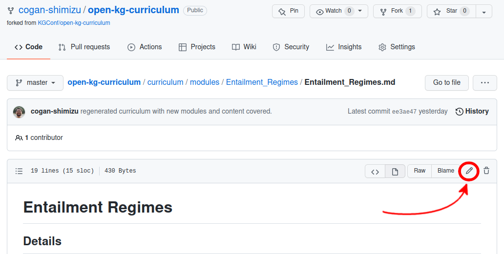
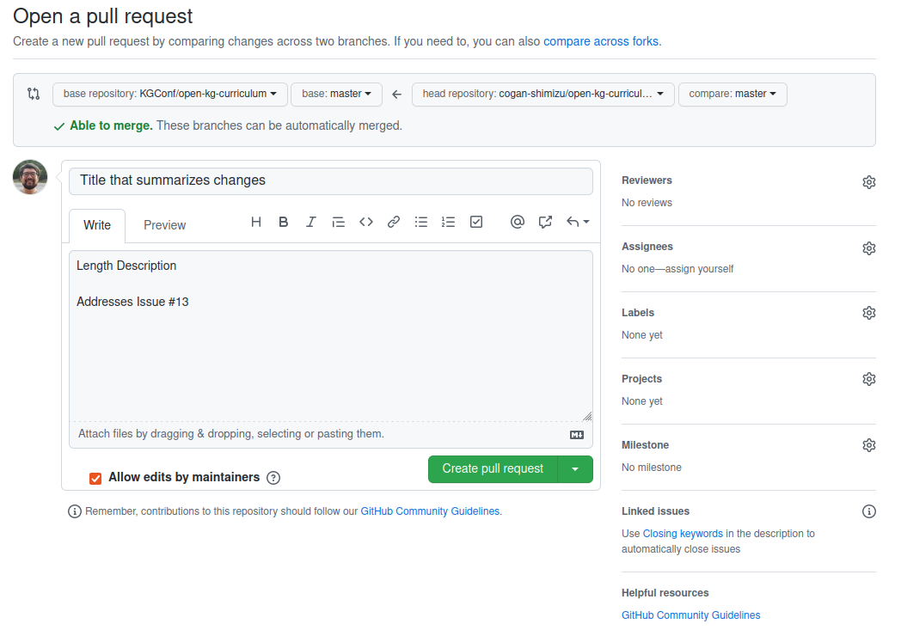

# Contribution Guidelines
Welcome to the contribution guidelines for the KGC's Open Curriculum on Knowledge Graphs! We're happy to have you; take a look down below for an overview of
* a guide of the _mechanics_ of contributing,
* what goes into contributing new content or to existing content, and
* what sort of contributions we're looking for.

## The Mechanics of Contributing
Technical Requirements for Contributing
- You need a GitHub Account
  - This is free and [quite easy to set up](https://docs.github.com/en/get-started/signing-up-for-github/signing-up-for-a-new-github-account)!

It will first help to get an idea of how contributing will work. GitHub allows us to manage something called a `git` repository, which allows us to track changes made to the contents of the repository. It is fair to think of it as a sort of "slowed down Google Docs." Essentially, changes are gatekept by a set of maintainers. Changes by the community are driven via discussion in Issues, discussions in the Slack workspace, and by making Pull Requests via the GitHub interface. In the following guide, we'll give a short tutorial on how to do this, if you're unfamiliar with git and GitHub. If you are already comfortable with this process, please skip to the end where we describe the "Contribution Process" and the corresponding expectations.

### The Process in a Nutshell
1. "Fork" the Curriculum. That means you're going to create a local copy of the curriculum that is free for you to edit.
2. Edit the Curriculum in place. 
3. Make a Pull Request, that will allow us to incorporate your changes into the Curriculum, pending discussion and review!
4. Discuss the Pull Request with the community and maintainers, as necessary!

### How do I "Fork" the repository?
* First ,click on the Fork Button.

* Choose your username from the list (this may not pop up if you don't have multiple profiles).
* This should put the local copy (the fork) into your own profile that you can freely edit!
* See Also: [Forking a Repository -- GitHub Docs](https://docs.github.com/en/get-started/quickstart/fork-a-repo)

### How do I edit the Curriculum?
* First, navigate to the file that you wish to edit.
* Click on the Edit Button (the pencil button) to edit the particular file.

* When you're done editing, at the bottom of the file, fill in a short description of the changes that you made. There is also space for an extended description.
* See Also: [Editing Files -- GitHub Docs](https://docs.github.com/en/repositories/working-with-files/managing-files/editing-files)

### How do I make a "Pull Request"?
* First, navigate to the Pull Request Panel
* Then, click on the "New pull request button".

* If GitHub indicates that the changes can be merged, go ahead and click on the "Create pull request" button.

* This will bring you to a page to title and describe your changes made in this Pull Request. Try to be descriptive! If you're addressing an issue from the parent repository, put that Issue's number in your description, like "Addresses Issue #123". This will help the maintainers review the changes to be accepted! You can also leave the right panel blank; the maintainers will fill this out!
* There are guidelines below for more specific sort of information that should be included with pull requests and issues.

* See Also: [Creating a Pull Request -- GitHub Docs](https://docs.github.com/en/pull-requests/collaborating-with-pull-requests/proposing-changes-to-your-work-with-pull-requests/creating-a-pull-request)

### How do I file an Issue?
* First, navigate to the [Issues Panel](https://github.com/KGConf/open-kg-curriculum/issues) of the Curriculum and click on the "New issue" button.

* Include a description of the nature of the issue; try to be as thorough as possible. 
* There are guidelines below for the sort of information that should be included in an issue or pull request.
* Add labels as appropriate.
* No Trolling; be polite!
* See Also: [Creating an Issue -- GitHub Docs](https://docs.github.com/en/issues/tracking-your-work-with-issues/creating-an-issue)

## A Guide for Contributing to Content
The first step to contributing is always to take a look at the [open issues page](https://github.com/KGConf/open-kg-curriculum/issues). New contributions can also be discussed on the [Slack Workspace]()! Also, keep in mind that contributions can, and often do, start quite small. As such, feel free to create a more open-ended issue and see where the discussion takes the feature-request.

For example, we could start with the question, "What does a Project Manager need to know about Tiger Graph?" At the time of this writing, we'd need a Project Manager audience created, a Module describing Tiger Graph, and a list of Concepts that are useful to know about a triplestore platform. Some might be new (e.g., "What is the cloud?") or might already be in our Curriculum (e.g., "Entailment Regimes").

The first two steps are always the same:
1. First, check the open issues and pull requests for related ideas! We don't want to duplicate our work :)
2. If there isn't, open a new Issue! The following headings below will describe what the differences are between the different conceptual items, and the sort of information that will help us create or modify them!

### How do I contribute a _Learning Path_?
3. detail
4. detail

### How do I contribute to an existing _Learning Path_?
3. detail
4. detail

### How do I contribute new a _Module_?
3. detail
4. detail

### How do I contribute to an existing _Module_?
3. detail
4. detail

### How do I contribute a new _Concept_?
3. detail
4. detail

### How do I contribute to an existing _Concept_?
3. detail
4. detail
