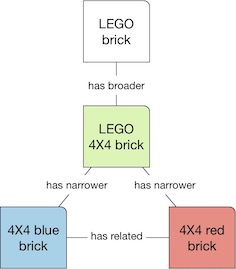

# SKOS
## Details
* Category: [Standards, Resources](../categories/Standards,_Resources.md)
* Module Prerequisites: [RDF](../modules/RDF.md)
* Audience: [Student, Developer](../audiences/Student,_Developer.md)
* Level: [Intermediate](../levels/Intermediate.md)

## About SKOS
The [**Simple Knowledge Organization System**](https://www.w3.org/2004/02/skos/) (SKOS) is a linked data standard promoted by the [World Wide Web Consortium](https://www.w3.org) (W3C) SKOS is designed to represent taxonomies and other classification systems. It offers a straightforward model for defining concepts--such as you might see in a dictionary or book index--and relating them to each other. Because of its relative simplicity, SKOS is often recommended to new practitioners learning how to develop taxonomies and ontologies using linked data.

The SKOS model is centered around a **concept**. Think about something that you might want to define and document in your own vocabulary, for example, "Sourdough bread," "Hybrid automobile," "European Union," or, in this case, a LEGO brick:

Our first concept, which we'll call LEGO_brick_4X4, represents a single type of brick, square and with four studs. But that brick doesn't exist in a vacuum. There can be millions of variations of LEGO parts; the example above is both more specific than some LEGO categories and more general than others:

In our second example, our original, generic 4X4 brick relates downward to more specific, _narrower_ versions in specific colors. It also relates upward to an even more general brick concept representing all of the possible variations in brick type, including as 1X2, 4X8, etc. Notice also that the blue and red variations of the are identified as _related to_ each other. They have some things in common without being in the same line of succession from our original brick.

So concept can relate to another concept in one of three primary ways:

* It can be **broader**, as in "Transportation" is a more general concept than "Automobile";
* It can be **narrower**, as in "Electric boat" represents a subset of the category "Boat";
* It can be **related** to another, similar concept that appears elsewhere in the model

Our high-level generic concept of a LEGO brick lives with other high-level umbrella concepts for things like plates and minifigures. These category concepts are known as **Top Concepts**.

Finally, at the highest level, we define the **Concept Scheme**. The concept scheme defines the overall theme of the vocabulary:

    
SKOS vocabularies tend to be designed hierarchically. All terms in the vocabulary fit into an overarching **concept scheme** defining its overall theme (e.g.,  "Agriculture" or "Film industry"). At the highest level of the model sit major categories known as **top concepts**. For example, a film industry vocabulary might include top concepts such as:

* Creative
* Business
* Legal
* Production

The vocabulary's designer then adds more specific concepts to each of the top concepts. "Creative," above, may contain underlying categories such as:

* Screenwriting
* Music
* Sets
* Directing

Each of the lower-level topics can expand outward with even more concepts. "Sets," above, might have two additional concepts:

* Sets
	* Set design
	* Set construction

Thus, a SKOS model expands outward in a tree structure from the concept scheme to top concepts to as many levels as needed to fully express a vocabulary. The model can be broad or deep, depending upon the number of top concepts vs. the number of nested levels of underlying concepts.

A concept can relate to another concept in one or three ways:

* It can be broader, as in "Transportation" is a more general concept than "Automobile";
* It can be narrower, as in "Electric boat" represents a subset of the category "Boat";
* It can be related to but different from a 

## Related KGC Media
* Workshop Example
* Tutorial Example

## References
[1] Reference example.

## Contributors
* Cogan Shimizu
