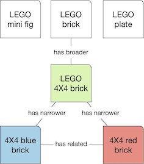

# SKOS
## Details
* Category: [Standards, Resources](../categories/Standards,_Resources.md)
* Module Prerequisites: [RDF](../modules/RDF.md)
* Audience: [Student, Developer](../audiences/Student,_Developer.md)
* Level: [Intermediate](../levels/Intermediate.md)

## About SKOS
The [**Simple Knowledge Organization System**](https://www.w3.org/2004/02/skos/) (SKOS) is a linked data standard promoted by the [World Wide Web Consortium](https://www.w3.org) (W3C) SKOS is designed to represent taxonomies and other classification systems. It offers a straightforward model for defining concepts--such as you might see in a dictionary or book index--and relating them to each other. Because of its relative simplicity, SKOS is often recommended to new practitioners learning how to develop taxonomies and ontologies using linked data.

The SKOS model is centered around a **concept**. Think about something that you might want to define and document in your own vocabulary, for example, "Sourdough bread," "Hybrid automobile," "European Union," or, in this case, a LEGO brick:

Our first concept, which we'll call LEGO_brick_4X4, represents a single type of brick, square and with four studs. But that brick doesn't exist in a vacuum. There can be millions of variations of LEGO parts; the example above is both more specific than some LEGO categories and more general than others:

In our second example, our original, generic 4X4 brick relates downward to more specific, _narrower_ versions in specific colors. It also relates upward to an even more general brick concept representing all of the possible variations in brick type, including as 1X2, 4X8, etc. Notice also that the blue and red variations of the are identified as _related to_ each other. They have some things in common without being in the same line of succession from our original brick.

So a concept can relate to another concept in one of three primary ways:

* It can be **broader**, as in "Transportation" is a more general concept than "Automobile";
* It can be **narrower**, as in "Electric boat" represents a subset of the category "Boat";
* It can be **related** to another, similar concept that appears elsewhere in the model

But let's take it a step further. We've mentioned that at the top level of our model sits a super concept covering all LEGO bricks. It actually sits alongside other super concepts covering other broad categories of LEGO parts, including minifigures and plates. These top-level concepts are known as **Top Concepts**:

Finally, at the highest level, we wrap up our enter model in something called a **Concept Scheme**. The concept scheme defines the overall theme of the vocabulary:

As you can infer from the above examples, taxonomies tend to be designed hierarchically. The hierarchies can vary in overall design. One SKOS taxonomy could be relatively wide, with a larger number of top concepts. Another could feature a succession of "narrower than" relations going many levels deep. The purpose of the taxonomy may define its overall structure: think of an ecommerce site covering a broad portfolio of high-level categories including electronics, housewares, personal care, and toys. A different structure might have limited options at the top level but do a deep dive into subcategories.

Now let's take a look at SKOS as it can be represented in [RDF](../modules/RDF.md). The following example was produced using the Turtle serialization, which is one of the most compact, straightforward, and popular formats for writing RDF:

@prefix : <http://mylegosite.com/LEGOCat#> .
@prefix rdf: <http://www.w3.org/1999/02/22-rdf-syntax-ns#> .
@prefix skos: <http://www.w3.org/2004/02/skos/core#> .

<http://melvinmasterlego.com/brick44>
  skos:prefLabel "brick44" ;
.
:LEGOBricks
  rdf:type skos:Concept ;
  skos:definition "General-purpose interlocking square or rectangular bricks with studs on the top and holes on the bottom." ;
  skos:narrower :LEGO_brick_4X4 ;
  skos:narrower :LEGO_brick_4X8 ;
  skos:prefLabel "LEGO bricks" ;
  skos:topConceptOf :LEGOParts ;
.
:LEGOMinifigs
  rdf:type skos:Concept ;
  skos:narrower :SpacePilotMinifig ;
  skos:prefLabel "LEGO minifigs" ;
  skos:topConceptOf :LEGOParts ;
.
:LEGOParts
  rdf:type skos:ConceptScheme ;
  skos:prefLabel "LEGO parts" ;
.
:LEGOPlates
  rdf:type skos:Concept ;
  skos:prefLabel "LEGO plates" ;
  skos:topConceptOf :LEGOParts ;
.
:LEGO_brick_4X4
  rdf:type skos:Concept ;
  skos:broader :LEGOBricks ;
  skos:exactMatch <http://melvinmasterlego.com/brick44> ;
  skos:narrower :LEGO_brick_4X4_blue ;
  skos:narrower :LEGO_brick_4X4_red ;
  skos:prefLabel "LEGO brick 4X4" ;
  skos:related :LEGO_brick_4X8 ;
.
:LEGO_brick_4X4_blue
  rdf:type skos:Concept ;
  skos:broader :LEGO_brick_4X4 ;
  skos:prefLabel "LEGO brick 4X4 blue" ;
  skos:related :LEGO_brick_4X4_red ;
.
:LEGO_brick_4X4_red
  rdf:type skos:Concept ;
  skos:broader :LEGO_brick_4X4_red ;
  skos:prefLabel "LEGO brick 4X4 red" ;
  skos:related :LEGO_brick_4X4_blue ;
.
:LEGO_brick_4X8
  rdf:type skos:Concept ;
  skos:prefLabel "LEGO brick 4X8" ;
  skos:related :LEGO_brick_4X4 ;
.
:SpacePilotMinifig
  rdf:type skos:Concept ;
  skos:historyNote "This general figure type was replaced with more specific designs pertaining to individual sets starting in 1985" ;
  skos:prefLabel "Space pilot minifig" ;
  skos:scopeNote "Limited to sets with product numbers 2474 to 3488" ;
.

## Related KGC Media
* Workshop Example
* Tutorial Example

## References
[1] Reference example.

## Contributors
* Cogan Shimizu
